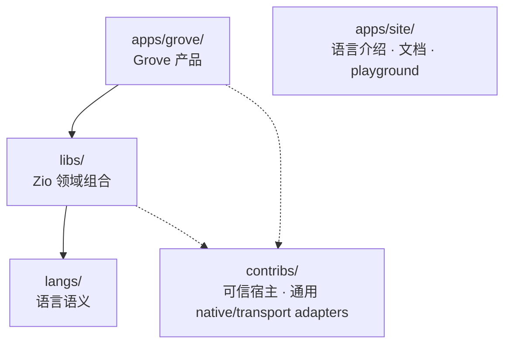

# Zio 系统架构

> Version 0.8 — language-first 平铺目录（2026-10-07）
>
> 本页区分已落地的结构迁移、已有运行能力与尚未实现的目标。
> 能力和历史实跑证据见[特性矩阵](feature-matrix.md)，数量见[项目状态](status.md)。
> 本次目录合同以[批准计划](superpowers/plans/2026-10-07-language-first-layout.md)为准；
> 旧 T/C/I/H/G 与 W00–W17 计划保留历史证据，不再规定当前物理布局。

## 1 语言优先的职责边界

Zio 是通用 Lisp 语言。ZOS 仍属于语言核心；库和应用不是语言内置组成。
Rust 保留语言运行时、可信宿主与必要原语；领域组合、策略与库的目标实现语言是 Zio。
这不是把独立 Rust 业务库重新命名为 Zio 库，也不是已经完成编译器自举。

| 层 | 当前物理位置 | 职责与状态 |
|---|---|---|
| 语言 | `langs/core/`、`langs/cli/` | Rust AST evaluator、Reader、宏、Experimental ZOS 与普通语言 CLI；`langs` 下直接平铺，不设 `langs/zio` |
| 标准库 | `libs/std/` | Zio `core.zio`、persistent、entity、protocol、pipeline、datalog；状态分别以特性矩阵为准 |
| 领域库 | `libs/numa/`、`libs/loom/`、`libs/learning/` | Zio vector、agent/proposer、learn/memory 与学习子模块；不因目录迁移而新增功能或发布包 |
| 基础设施 | `contribs/native/loom/` | 已有通用 Rust 模型/工具合同、预算、传输与教师适配；Rust crate 名仍为 `loom`，不是 `libs/loom/` 的 Zio 库 |
| 语言站点 | `apps/site/` | 语言介绍、文档与 WASM playground；不是 Grove 产品 |
| Grove 应用 | `apps/grove/` | `main.zio` 是实际 Zio 入口，组合 Loom 通用 agent 循环；`selection.zio` 决定 accuracy 与质量／成本候选筛选；其他 Rust 业务仍在 `native/app/` 与 `native/learning/`，CPU 后端在 `workers/torch/` |



> 应用业务用 Zio 表达，`libs/` 组合领域能力，`langs/` 定义语言语义；
> 可信宿主与传输适配器留在 `contribs/`，站点独立承载语言文档与 playground。

核心不反向依赖 Grove 业务或通用 harness。普通 `zio-cli` 只装配语言环境，
不提供 `--llm-replay`；模型与 replay 合同仍由 `contribs/native/loom/`
及明确装配它的应用/宿主管理。

## 2 已完成的结构切换与未完成的业务迁移

2026-10-07 首轮切换移动了源树、库文件与消费路径，取消旧根目录入口，
没有兼容别名、symlink 或空占位目录。它不改变下面的能力验收口径：

- Rust 语言实现仍在 `langs/core/`；完整展开/分析、bytecode VM、JIT 和自举编译器为 Planned。
- `.zio` 库已归入 `libs/`，但 Datalog 查询等未实现能力不会因移动文件而完成。
- Grove 的 `apps/grove/main.zio` 按宿主授权组合 `libs/loom/agent.zio`；`apps/grove/selection.zio`
  已接管候选筛选，CLI 与 HTTP 共用一条 typed adapter，原 Rust `Candidate`/`non_dominated` 已删除。
  应用的存储、调度、评估记录、发布硬门槛、治理、CLI/HTTP 外壳及其他 Rust 业务仍在 `apps/grove/native/`。
  **这些业务后续迁为 Zio 是目标，当前 Grove 并未整体重写为 Zio。**
- `contribs/native/loom/` 保留可复用 native transport/host adapter，
  不把其整个 Rust 实现当成未来 Zio Loom 库的目标本体。
- Tree-sitter 与 LSP 是后续工具目标，当前没有已交付实现；目录变更不证明工具链自托管。

目录迁移只证明结构归属。下表区分首轮切换与后续业务迁移的 Linux x64 实跑证据，不泛化为其他平台验收：
结构切换命令、警告与验收记录见[首轮计划](superpowers/plans/2026-10-07-language-first-layout.md#verified-integration-results-2026-10-07)，后续入口与候选筛选记录见[业务迁移计划](superpowers/plans/2026-10-07-grove-zio-entry.md#follow-on-real-candidate-selection-policy)。

| 表面 | 已观察到的证据 |
|---|---|
| Rust workspace | 候选筛选迁移后 `cargo test --workspace --all-features`：491 passed，48 suites，0 failures |
| torch worker | 首轮：77 个 Python 合同测试通过；真实隔离路径通过，未以无隔离模式替代 |
| 普通语言 CLI | 首轮：basics、ZOS、learn 示例实际运行；后续：混合数值排序和 Grove Zio 策略实跑。CLI 的直接依赖为 `im` 与 `zio-core`，不再含 Loom |
| 构建与站点 | 首轮：WASM、Astro、Docker 镜像与 nginx 46 页通过；后续：重建 WASM/Astro，47 页构建通过，未重新构建 Docker 镜像 |
| 浏览器 | 首轮：多行编辑、持久定义、reader 错误恢复与 390/768/1024 宽度验证；后续：六个真实 WASM 预设、混合数值排序和 Ctrl+Enter 实跑，390px playground/Grove 无观察到的横向溢出，桌面与移动端截图已检查 |
| Grove | 首轮：真实双路 CPU 候选与人工审批/重放/冲突拒绝；后续：CPU 基线 0.53125、候选 1.000，CLI/HTTP 的 Zio 筛选一致且不发布，未知 token 403 拒绝 |
| 状态与限制 | `tools/project-status.sh --check` 通过；默认 feature 的测试清单为 476，不等同于全 feature 实跑数量。Grove Zio 化、自举编译器及其他平台验证未完成 |

## 3 当前组成与演进方向

### 3.1 原生 workspace 与 Zio 库

```text
langs/cli/ (zio-cli：REPL、脚本、模块根配置)
└── langs/core/ (zio-core：Reader、AST eval/apply、ZOS、WASM 入口)

apps/grove/native/app/ (grove-app，binary grove)
├── apps/grove/native/learning/ (grove：现有 Rust 业务/可信宿主)
├── contribs/native/loom/ (loom：通用 native harness/transport)
└── langs/core/

apps/grove/workers/torch/ (CPU 参考后端，不是 crate)
libs/{std,numa,loom,learning}/ (Zio 源文件，不是 Rust workspace crate)
```

具体 Cargo feature 与依赖以实际 manifest 为准，不在文档复制固定 crate/测试数量。
`apps/grove/main.zio` 定义 Grove 的 `agent-entry`，通过有根的 `require :libs.loom.agent :refer [agent-run]` 导入通用循环，不依赖进程 cwd；`libs/loom/proposer.zio` 是提议器。
`apps/grove/selection.zio` 接收 keyword 行字段、保留 string 名称的指标对，决定 accuracy（缺失按零质量）、门槛失败候选排除与质量／成本比较；native 适配器只转换 `evaluation::Comparison` 并检查返回的整数行索引，不授予 Grove 存储、模型或发布 bindings。该策略在构建时嵌入 native 外壳；目前 CLI/HTTP 成本仍为 1，且保留同质同价互相排除的原弱比较行为，不声称热更新或完整推理成本核算。
`libs/learning/` 持学习与记忆组合，`libs/numa/vector.zio` 持向量计算，
学习/评价/发布治理不进入通用计算或传输适配器。

### 3.2 目标库与应用

Numa（计算）、Rill（CLI 组合）、Loom（harness）是 Zio 领域库方向，
不再以独立 Rust 业务库为目标。Rill 尚无落地库目录，不创建占位目录；
正式短名不保证注册表包 ID 或已发布版本。只在真实消费需要时补齐公开合同。
Grove 是 `apps/grove/` 独立应用，不是语言 playground；其业务逐步迁入 Zio，
可信授权、事务、隔离和原生后端仍按明确合同保留必要宿主边界。

### 3.3 工具链自举（Planned）

1. 固定必需语言、数值、模块、源码位置与首轮 ZOS 语义合同。
2. 用 Zio 实现完整展开与分析；Rust AST 执行器是初始环境及语义对照。
   当前 `macroexpand` 只反复展开最外层，不等于完整编译前端。
3. 用版本化便携字节码与 Rust 最小执行后端引导 Zio 编译器，不同时要求优化 ZIR/JIT。
4. 编译器编译自身并重复构建，对照规范化产物与程序行为。

应用业务迁为 Zio、语言站点运行 WASM 和解释器加载 `.zio` 库均不等于自举。
完整 MOP 仍为演进目标；应用迁移与编译器自举分别验收。

## 4 规划性能目标

以下数字是设计目标，不是当前基准结果。当前可复现的 AST 测量见
[AST evaluator baseline](../benchmarks/README.md)；ZIR、VM 和 JIT 状态为
[Planned](feature-matrix.md)。

本页不复制某台机器上的当前耗时。已批准设计中的 VM/JIT 性能数字仅是未来
验收目标；比较必须使用 AST baseline 文档规定的相同 workload、engine、
release build 与 machine metadata。

## 5 跨平台目标

| 目标 | Rust target | 状态 |
|------|-------------|------|
| Linux x86_64 | `x86_64-unknown-linux-gnu` | 开发与本轮运行验证平台 |
| macOS ARM | `aarch64-apple-darwin` | 目标平台，本轮未验证 |
| macOS x86_64 | `x86_64-apple-darwin` | 目标平台，本轮未验证 |
| Windows | `x86_64-pc-windows-msvc` | 目标平台，本轮未验证 |
| WASM | `wasm32-unknown-unknown` | Experimental（浏览器 playground），独立构建验收 |
| ARM Linux | `aarch64-unknown-linux-gnu` | 目标平台，本轮未验证 |

---

## 6 相关文档

| 文档 | 内容 |
|------|------|
| [zio-philosophy.md](zio-philosophy.md) | 语言哲学、设计定理、设计原则 |
| [feature-matrix.md](feature-matrix.md) | 权威能力状态与证据 |
| [status.md](status.md) | 自动生成的仓库事实 |
| [eval-pipeline.md](eval-pipeline.md) | Eval 循环、TCO、宏系统、编译器管线 |
| [zos-spec.md](zos-spec.md) | ZOS 完整规范（Class/GF/Method/MOP/Condition） |
| [roadmap.md](roadmap.md) | Phase 路线图、交付标准、依赖分析、应用蓝图 |
| [adrs.md](adrs.md) | 架构决策记录（ADR-001 ~ ADR-019） |
| [self-learning-architecture.md](self-learning-architecture.md) | Grove 独立应用、同像性逻辑、生成执行与受控升级 |
| [glossary.md](glossary.md) | 术语参考 |
| [superpowers/plans/2026-10-07-language-first-layout.md](superpowers/plans/2026-10-07-language-first-layout.md) | 当前目录切换合同；旧 T/C/I/H/G 与 W 计划保留历史证据 |
